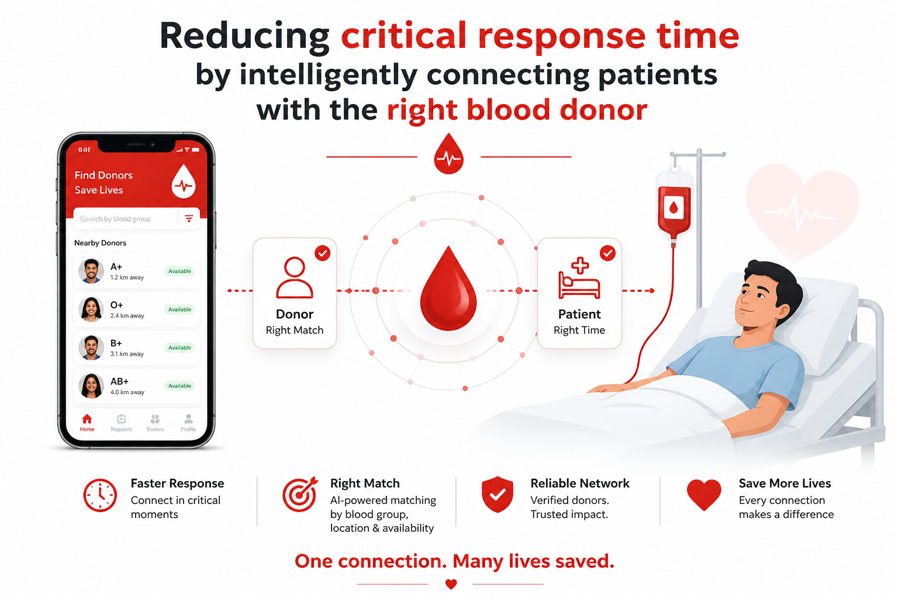
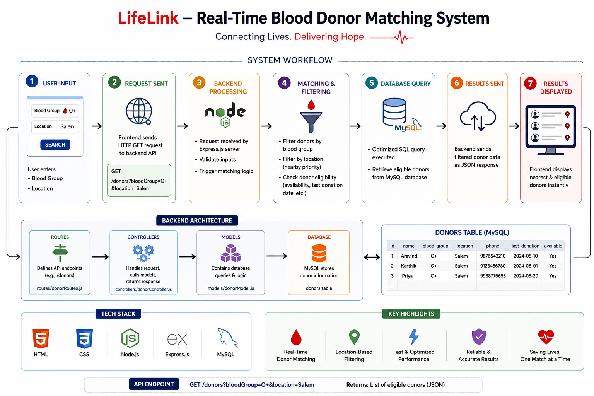

# 🩸 LifeLink — Real-Time Blood Donor Matching System

> 🚑 **Reducing critical response time by intelligently connecting patients with the right blood donors.**



---

## 📌 Overview
**LifeLink** is a data-driven web application built to solve a real-world emergency problem:  
➡️ *finding the right blood donor quickly and reliably.*

The system uses **backend-driven filtering and optimized database queries** to instantly return **relevant, eligible donors** based on user input.

---

## 🚀 Key Features

🩸 **Real-Time Donor Matching**  
- Retrieves eligible donors instantly based on blood group  

📍 **Location-Based Filtering**  
- Prioritizes nearby donors for faster response  

🧠 **Smart Data Processing**  
- Filters and preprocesses donor data to remove irrelevant entries  

⚡ **Optimized Backend Performance**  
- Efficient query handling using **Node.js + MySQL**  

🖥️ **Simple, Purpose-Driven UI**  
- Designed for speed and clarity in emergency scenarios  

---

## 🛠️ Tech Stack

| Layer | Technology |
|-------------|-----------|
| Frontend | HTML, CSS |
| Backend | Node.js, Express.js |
| Database | MySQL |
| Architecture | REST API |

---

## 🔄 System Workflow



1️⃣ User inputs **blood group & location**  
2️⃣ Backend applies **filtering & matching logic**  
3️⃣ MySQL returns **eligible donor data**  
4️⃣ System displays **optimized results instantly**  

---

## 📂 Project Structure

```bash
LifeLink/
│── public/ # Frontend (HTML, CSS)
│── routes/ # API routes
│── controllers/ # Business logic
│── models/ # Database queries
│── config/ # DB configuration
│── app.js # Entry point
│── package.json


# Clone repository
git clone https://github.com/Shrichackran/LifeLink---Smart-Blood-Donation-Platform
.git

# Navigate to project
cd LifeLink---Smart-Blood-Donation-Platform


# Install dependencies
npm install

# Run server
node app.js


GET /donors?bloodGroup=O+&location=Salem
